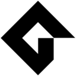

| Language | Opinion |
| --- | --- |
|  |     |
|  |     |
|  |     |
|  |     |
|  |     |
|  |     |
|  |     |
|  |     |
|  |     |
|  |     |
|  |     |
|  |     |
|  |     |
|  |     |
|  |     |
|  |     |
|  |     |
|  |     |
|  |     |
|  |     |
|  |     |
|  |     |
|  |     |
|  |     |
|  |     |
|  |     |
|  |     |
|  |     |
|  |     |
|  |     |
|  |     |
|  |     |
|  |     |
|  |     |
|  |     |
|  |     |
|  |     |
|  |     |
|  |     |
|  |     |
|  |     |
|  |     |
|  |     |
|  |     |
|  |     |
|  |     |
|  |     |